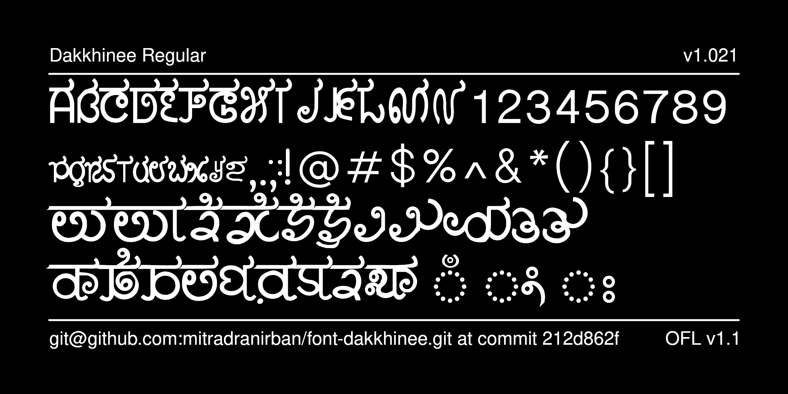

-

# Dakkhinee - A Bangla font inspired by South Indian scripts 

[![][Fontbakery]](https://mitradranirban.github.io/font-dakkhinee/fontbakery/fontbakery-report.html)
[![][Universal]](https://mitradranirban.github.io/font-dakkhinee/fontbakery/fontbakery-report.html)
[![][GF Profile]](https://mitradranirban.github.io/font-dakkhinee/fontbakery/fontbakery-report.html)
[![][Outline Correctness]](https://mitradranirban.github.io/font-dakkhinee/fontbakery/fontbakery-report.html)
[![][Shaping]](https://mitradranirban.github.io/font-dakkhinee/fontbakery/fontbakery-report.html)

[Fontbakery]: https://img.shields.io/endpoint?url=https%3A%2F%2Fraw.githubusercontent.com%2Fmitradranirban%2Ffont-dakkhinee%2Fgh-pages%2Fbadges%2Foverall.json
[GF Profile]: https://img.shields.io/endpoint?url=https%3A%2F%2Fraw.githubusercontent.com%2Fmitradranirban%2Ffont-dakkhinee%2Fgh-pages%2Fbadges%2FGoogleFonts.json
[Outline Correctness]: https://img.shields.io/endpoint?url=https%3A%2F%2Fraw.githubusercontent.com%2Fmitradranirban%2Ffont-dakkhinee%2Fgh-pages%2Fbadges%2FOutlineCorrectnessChecks.json
[Shaping]: https://img.shields.io/endpoint?url=https%3A%2F%2Fraw.githubusercontent.com%2Fmitradranirban%2Ffont-dakkhinee%2Fgh-pages%2Fbadges%2FShapingChecks.json
[Universal]: https://img.shields.io/endpoint?url=https%3A%2F%2Fraw.githubusercontent.com%2Fmitradranirban%2Ffont-dakkhinee%2Fgh-pages%2Fbadges%2FUniversal.json

Dakkhinee is an attempt to visualise how Bengali script would have evolved had it been a South Indian scripts like Telegu or Kannadda. 

Each Indic script has evolved in it own way from Brahmi and Kharosti depending upon materials used in writing

## About

The font is being created by Dr Anirban Mitra, an amateure typographer involved in creating one of the earliest Open Type Bangla font. 

The Latin glyphs are also given a Kannada like look. 

 

## Building

Fonts are built automatically by GitHub Actions. We will release the beta 
If you want to build fonts manually on your own computer:

* `make build` will produce font files.
* `make test` will run [FontBakery](https://github.com/googlefonts/fontbakery)'s quality assurance tests.
* `make proof` will generate HTML proof files.

The proof files and QA tests are also available automatically via GitHub Actions - look [here](https://mitradranirban.github.io/font-dakkhinee).

## Changelog

2024-08-21 Initial Release Version 1.001
 

## License

This Font Software is licensed under the SIL Open Font License, Version 1.1.
This license is available with a FAQ at [sil site](https://scripts.sil.org/OFL)

## Repository Layout

This font repository structure is inspired by [Unified Font Repository v0.3](https://github.com/unified-font-repository/Unified-Font-Repository), modified for the Google Fonts workflow.
